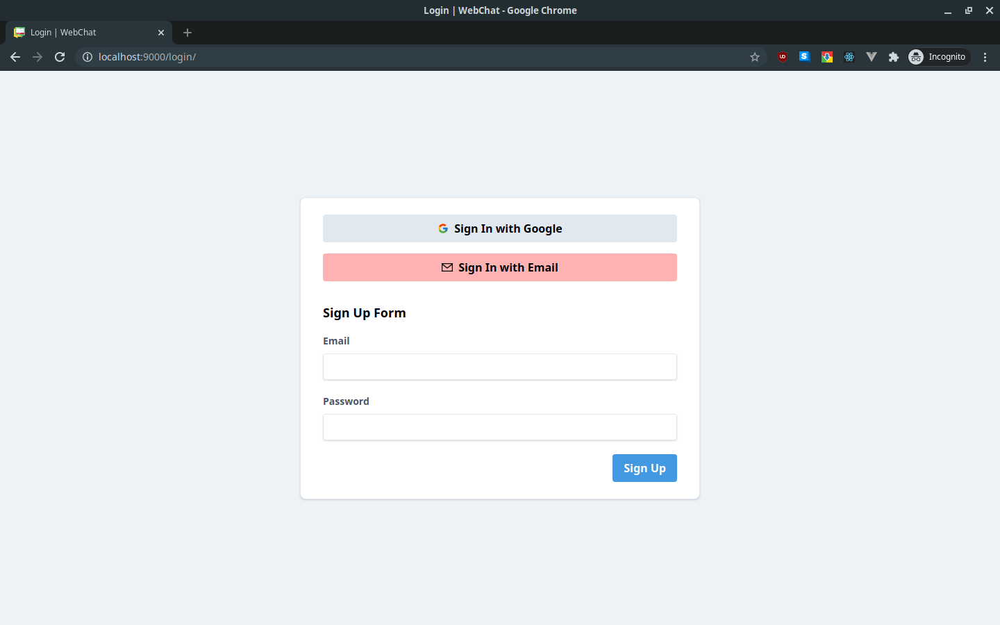
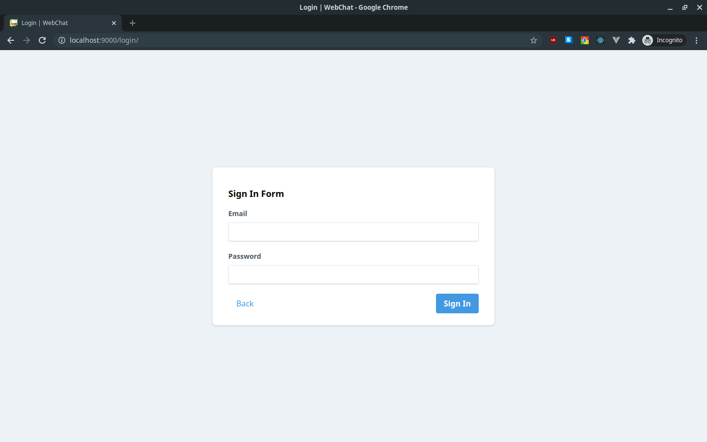
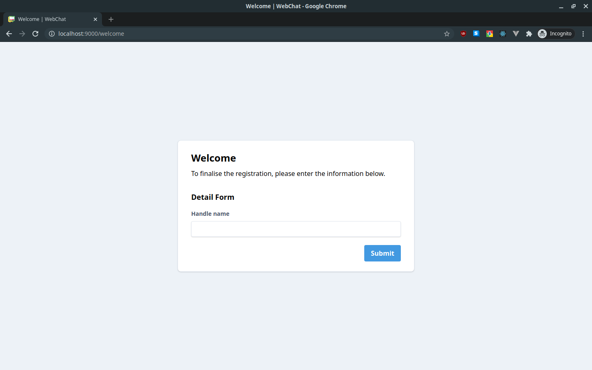
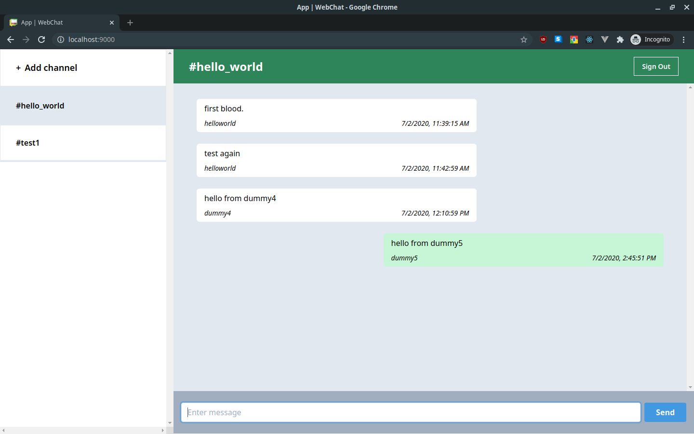

# Gatsby WebChat
> This project is a application for web-based chat application using Gatsby and Firebase.

---

## Table of contents
* [General info](#general-info)
* [Screenshots](#screenshots)
* [Technologies](#technologies)
* [Setup](#setup)
* [Features](#features)
* [Credits](#credits)
* [Contact](#contact)

---

## General info
This project is using Firebase Firestore to real-time update the chat messages between users.
It works by using onSnapshot method to listen the collection of messages, if updated, get latest data and render the messages.

It supported the following authentication methods:
- Email/Password authentication
- Google authentication

Use the following link to access the application: [https://webchat.anasdidi.dev](https://webchat.anasdidi.dev)

---

## Screenshots





---

## Technologies
* Gatsby: version 2.15.36
* React: version 16.10.2
* TypeScript: version 3.6.4
* Tailwindcss: version 1.4.6
* Firebase: version 7.15.3

---

## Setup
This project configured with Docker Compose to setup the development environment by using VSCode Devcontainer.
Ensure VSCode plugin 'Remote Development' `ms-vscode-remote.vscode-remote-extensionpack` is installed.

1. Clone this repo.
2. Open VSCode and open project in containar.
3. Install the dependencies.
```
yarn install
```
3. Start the development server.
```
yarn start
```
4. Open browser and open `http://localhost:8000` to view the page.

If Docker Compose is not installed, you may use the following guide.
This guide required Node is installed in the machine.

1. Clone this repo.
2. Install the dependencies
```
yarn install

# Or if yarn is not installed
npm install
```
3. Configure the script. You need to find and replace the lines according:
```
# package.json

--- Original
"develop": "gatsby develop --host 0.0.0.0 --port 8000",
--- Replace
"develop": "gatsby develop --port 8000",
```
4. Start the development server.
```
yarn start

# Or if yarn is not installed
npm start
```
4. Open browser and open `http://localhost:8000` to view the page.

---

## Features
* The user can sign up using their Google account or email/password.
* The user can enter handle name to be used in the application.
* The user can add new channel and joining to the channel.
* The user can submit message to channel which will be send to others in the channel.
* The user can sign out from the application.

---

## Credits
* Gatsby starter [gatsby-starter-default-typescript](https://www.gatsbyjs.org/starters/andykenward/gatsby-starter-default-typescript/) by andykenward.
* Icons made by <a href="https://www.flaticon.com/authors/pixel-perfect" title="Pixel perfect">Pixel perfect</a> from <a href="https://www.flaticon.com/" title="Flaticon"> www.flaticon.com</a>
* Icons made by <a href="https://www.flaticon.com/authors/freepik" title="Freepik">Freepik</a> from <a href="https://www.flaticon.com/" title="Flaticon"> www.flaticon.com</a>

---

## Contact
Created by [Anas Juwaidi](mailto:anas.didi95@gmail.com)
